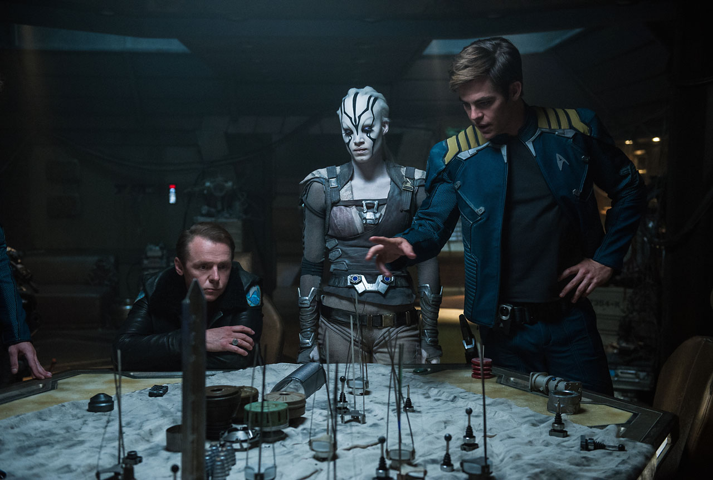

So, it's been nearly two months since my last (i.e., first) blog post, and I figured it's about time I tried again. I guess I just have so much to say that it takes me so long to say it and I get overwhelmed and don't write anything at all. I suppose that learning to be concise is just as important a writing skill as any! Because I really do want to improve y writing skills and because I really do enjoy articulating myself in this format, I decided to just open a text file and write _something_ to at least get myself back in the habit. So here are a couple of things that have been going on in my life recently that I can devote a paragraph to.

### Pseudorandom thoughts (probably the first installment of many)
I'll be honest and admit I have a lot of opinions about random shit and will probably enjoy getting them out into the universe. Thus I doubt this will be the final installment of this genre of post. I've decided to stick to three things, or I'll be here all night, and I'll have fallen for precisely the same thing as last time I tried to do this! Let's dive in!

##### Ready Player One

I just finished reading Earnest Cline's 2011 novel about a distopian future in which most societies have more or less collapsed and real life is miserable, but people live their lives in an utterly convincing virtual reality simulation, that's basically the best ever MMORPG (leveling your character by going on quests; PVP play; fantasy and futuristic places to visit). The book's stuffed to bursting with nerd pop-culture references - mostly 80s movies, music and video games, which certainly sets it apart from any other 'serious' novel I've read. 

I really enjoyed the world-building, and the writing style made it very readable, in the sense that the story moved very quickly and you were never confused about what was going on. For most of the story there are very few characters to keep track of, primarily the protagonist (Wade), his best friend, and his crush/girlfriend. There's somewhat of an interesting dynamic in that these best friends are simultaneously Wade's most serious competitors in a giant eater egg hunt of which the winner will become one of (if not _the_) most powerful person in the world. Surprisingly, the circumstances of this contest are set up in a mostly believable way (see: enjoyable world-building). So, overall I did enjoy the book, and I'm glad I read it. Especially prior to the forthcoming Spielberg adaptation. That said...

I did feel that the story was ultimately a little simple and felt a lot like many children's (or YA) books in a way I'm struggling to put my finger on, but will attempt to articulate (that's the point of this exercise right?). Basically, (spoiler alert!) Wade ends up winning the contest, despite the best efforts of a hugely well-funded and well-organized operation who are also out to win that contest. I suppose I just didn't buy that this kid, who, fair enough, had dedicated his life to this contest, would really be able to beat this huge organization. Basically on numerous occasions, he just gets really, really lucky. It's just like I didn't buy that Harry Potter, the Hardy Boys, the Famous Five, etc, etc, would so consistently survive legit evil dudes and solve the mystery and save the day as in every kids adventure story. In Ready Player One, as in those other cherished books, it just felt like weak story-telling designed to have the happiest possible ending, and the story rarely even threatened to twist or turn in such a way as to make me suspect this wasn't going to go well for our hero.

##### Star Trek: Beyond

I really disliked the previous movie, Star Trek: Into Darkness. The story was a mess that fell apart as soon as you thought about it for more than 3 seconds and it couldn't decide if it wanted to try to appeal to fans of the classic series and movies (especially Wrath of Khan) and ended up insulting said fans (which includes me) with super-forced references that totally didn't work. The new movie, Beyond, is _so_ much better than Into Darkness. I wouldn't go so far to say it was a genuinely great movie, but I'm honestly not sure _any_ Star Trek movie really qualifies for that distinction, (yeah, even II and IV). What's more, no Star Trek movie has ever really held up against the best episodes of the TV series, as they've tried to focus on action and adventure rather than the intelligent, thought-provoking, brains-over-braun fare that made the TV series' so beloved. 

So all that said, Star Trek: Beyond seemed to understand that an intelligent, competent crew that works better as a team playing to their respective strengths is a key piece of what makes Trek, Trek and benefits hugely from that. It's a fun adventure with a healthy mix of laughs and action and handles the ensemble cast well. I liked that Scotty (Simon Pegg) and Bones (Karl Urban) were a little more at the forefront than they had been in the previous movies. They are fun characters played by actors I like. Kirk and Spock had good (if not super complex) character arcs, Sulu had a gay partner and nobody cared he was gay, and we got to listen to the Beasty Boys in a contrived but not entirely far-fetched way.

##### Living Alone

I moved into a new apartment and am living on my own for the first time in my life! It's been a little over two weeks since I moved and I'm still getting to grips with it. It's been very expensive buying all the new stuff I need to furnish the new place, but it's really starting to feel like home. In fact, I'm kinda regretting the 3+ week trip I have coming up, because I like my place and my stuff and my neighborhood and I'm going to miss it! 

I'm still getting the hang of how to not get lonely, or into one of those 'depressed' funks I have often found myself in when deprived of the right kinds of stimulation (usually: interacting with the more likable humans). There are plenty of bars and coffee shops very nearby (I'm working from such an establishment as I type!) so, I need to make sure to utilize those, and hopefully even strike up conversations and friendships with other neighbors and regulars. 

I do have an essentially endless list of video games, movies, TV shows and comic books to work through, and it would be very easy for me to stay in and get stoned and fat and just do that every night! In a way I'd enjoy it, but in another way I'd go insane from the lack of human-interaction. I just have to figure out how to reconcile my social anxiety and inability to talk to strangers with my strong need to interact with people. Hey at least I've identified my problem... 33 years in... maybe it'll only take me a few more to figure out the solution! :p

